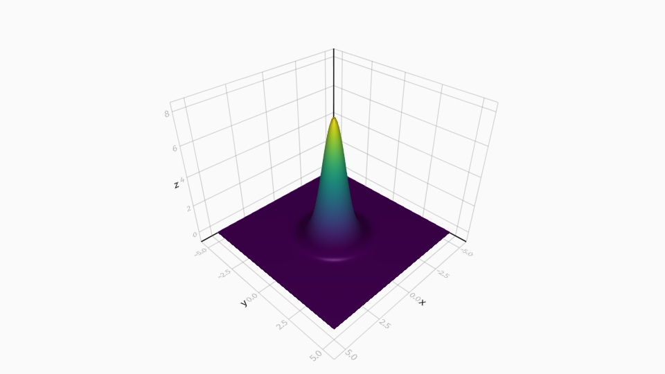

# LaserTypes
[build-img]: https://github.com/SebastianM-C/LaserTypes.jl/workflows/Run%20CI%20on%20master/badge.svg
[build-url]: https://github.com/SebastianM-C/LaserTypes.jl/actions
[codecov-img]: https://codecov.io/gh/SebastianM-C/LaserTypes.jl/branch/master/graph/badge.svg
[codecov-url]: https://codecov.io/gh/SebastianM-C/LaserTypes.jl
[docs-img]: https://img.shields.io/badge/docs-dev-blue.svg
[docs-url]: http://SebastianM-C.github.io/LaserTypes.jl/dev/

[![build status][build-img]][build-url]
[![codecov][codecov-img]][codecov-url]
[![docs][docs-img]][docs-url]
[](https://zenodo.org/badge/latestdoi/238252086)

This package aims to provide a common interface for different laser types. For the spatial profiles
supported are Gauss and Laguerre-Gauss (with more to be added in the future).

### Instalation

To install this package use
```
]add LaserTypes
```

### Usage

The `setup_laser` function can be used to initialize the parameters for the laser
depending on the laser type and units.
The keyword arguments can be used to give specific values to the parameters instead of using the defaults.
You can specify parameteres such as the wavelength and beam waist via `λ` and `w₀`.
For example for a 800nm Gaussian laser pusle in SI units use:
```julia
using LaserTypes

s = setup_laser(GaussLaser, :SI, λ=8e-7)
```
This will create a structure containing all the parameters required to describe the laser.
The `E` and `B` functions give the value of the electromagnetic fields at a space-time point specified by `r,t`.
For example, to evaluate the electric field at the origin use
```julia
using StaticArrays

x₀ = SVector{3}(0,0,0)
t₀ = 0

E(x₀, t₀, s)
```

We can visualize the intensity of the created electric field with [Makie.jl](https://github.com/JuliaPlots/Makie.jl) like this:
```julia
using Makie
using LinearAlgebra

f(x,y) = norm(E(Point3f0(x,y,0), 1, s))
sc = surface(-5e6:1e4:5e6, -5e6:1e4:5e6, f)
scale!(sc, 1, 1, 1/4)
```


The package can also work with [Unitful.jl](https://github.com/PainterQubits/Unitful.jl) and [UnitfulAtomic.jl](https://github.com/sostock/UnitfulAtomic.jl) units. For those
you just need to initialize the laser using `:SI_unitful` or `:atomic_unitful`
and use the corresponding units for the coordinates.
